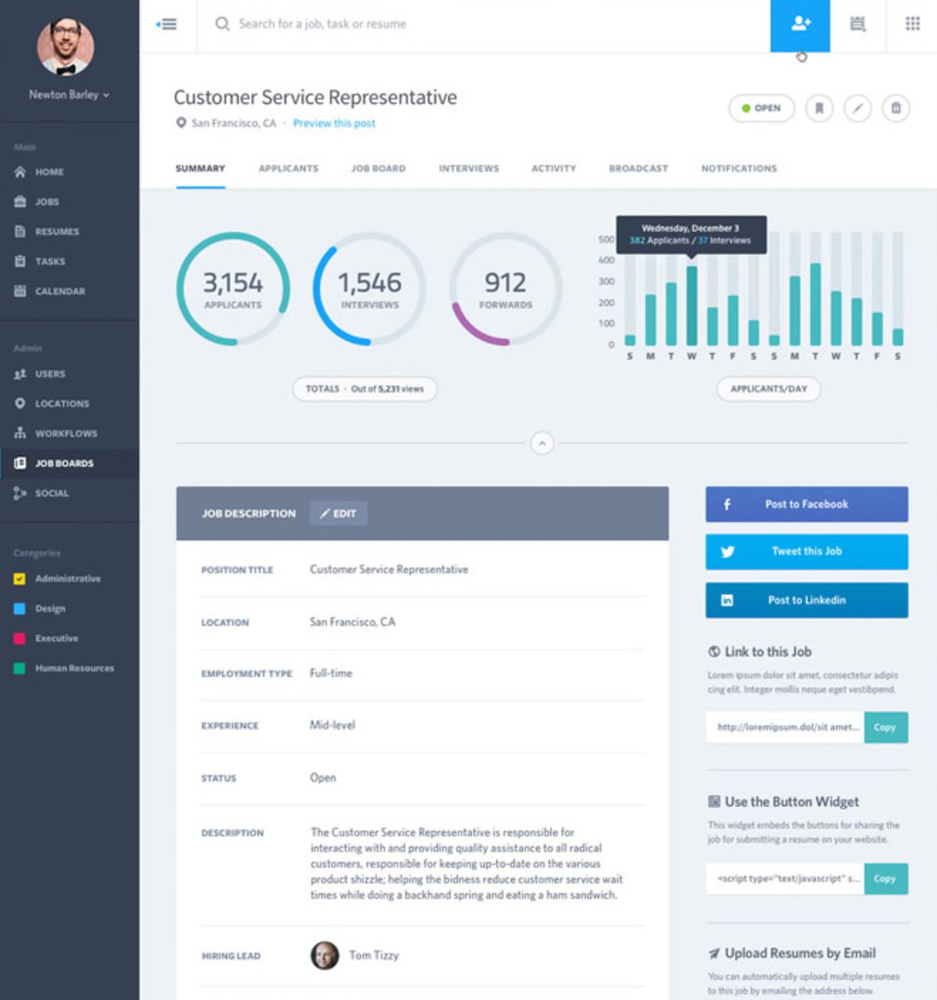
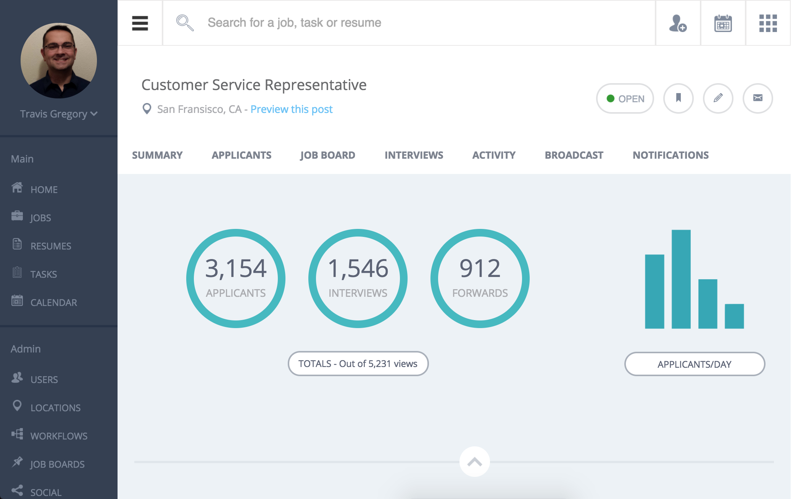
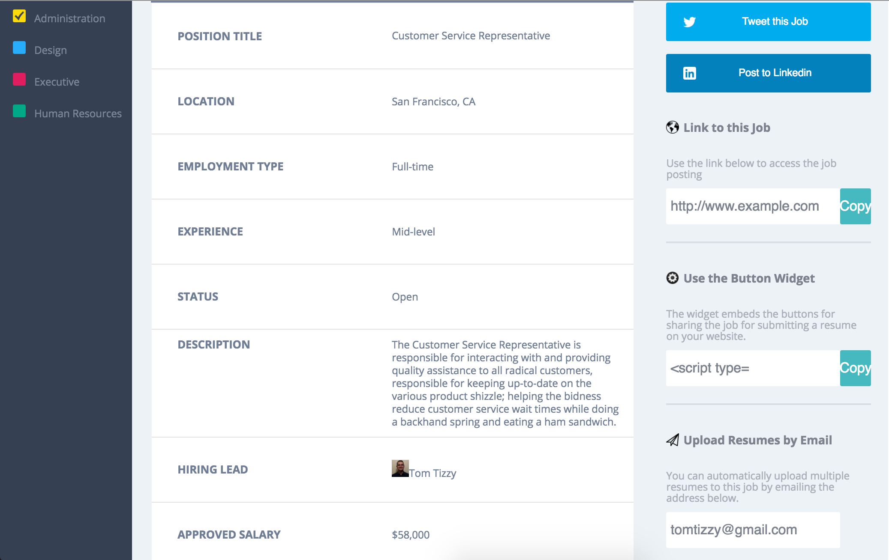
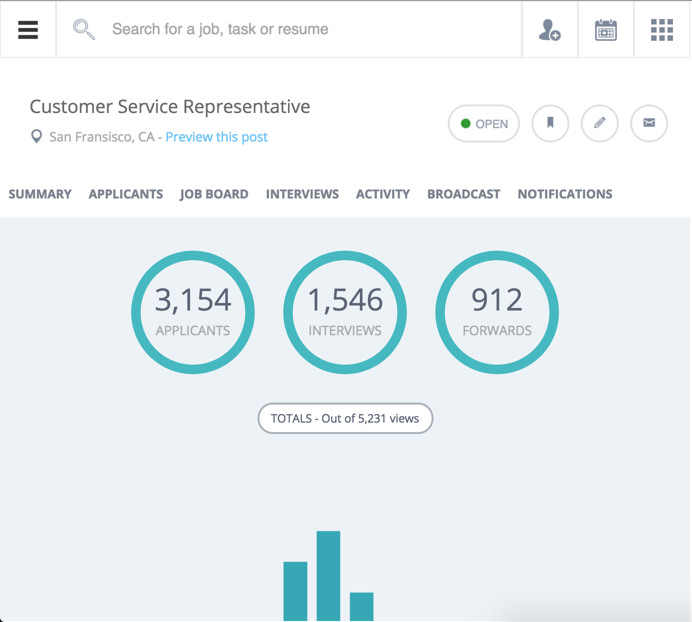
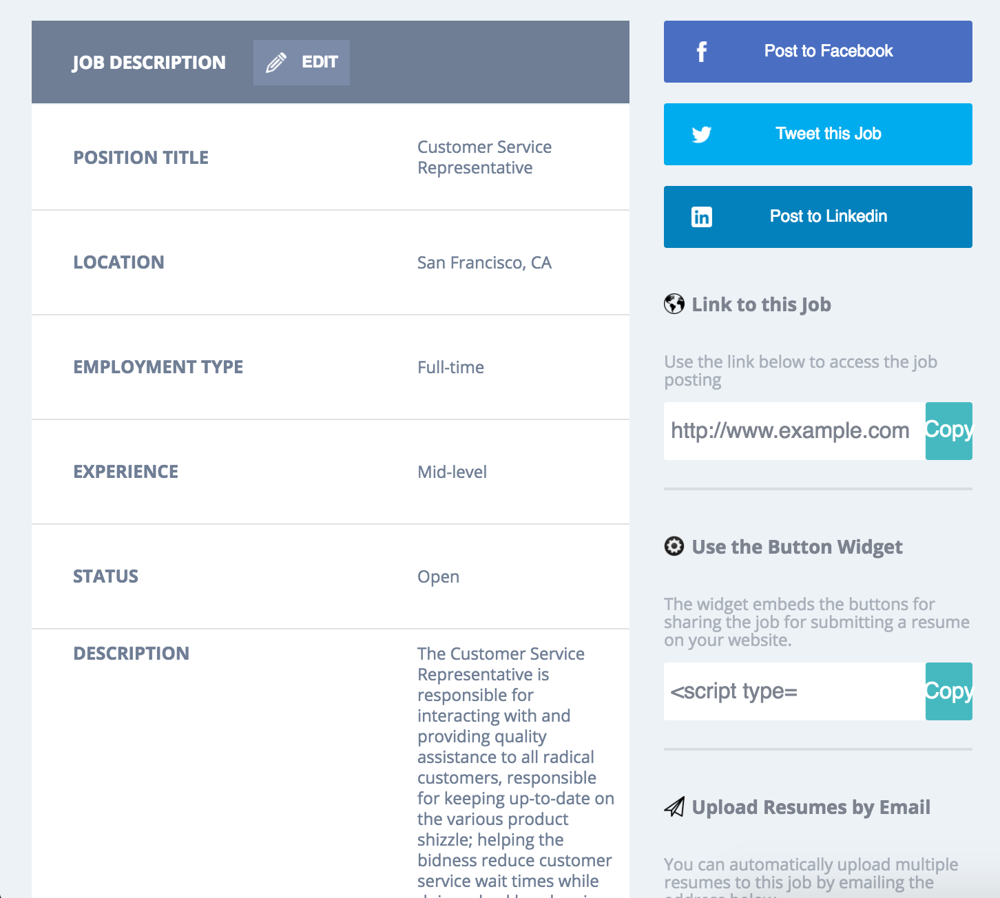
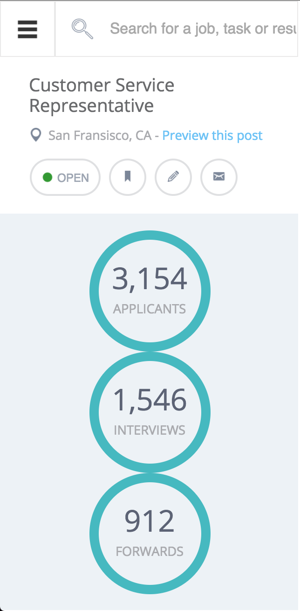

## tg-comp-challenge-3

### Overview
This project is the third and final of three static comp challenges that require us to build a website with only a comp to guide us. In this specific project, we were given a comp with no assets. The only requirement was that we stick to the layout. Some creative license was given to us with relation to the copy, images, icons, and the color palette.

### Original Comp:

### My Comp:

#### Desktop View:

#### Tablet View:

#### Mobile View:

